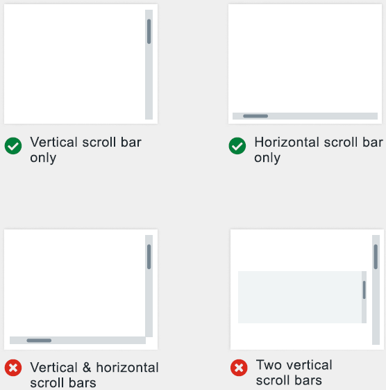
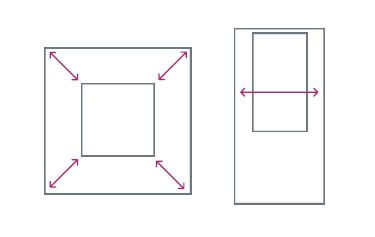
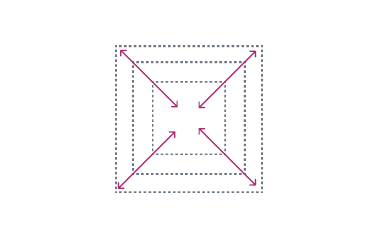

# Setting up layout

## Page layout
### Heading & Intro

## Dashboard layout

## Web wrapper

## Navigation

## Adaptive webview or fixed view

### Fitting

The sheet size that fits in a Tableau workbook during development is different from what it will look like once published, and may be different from how it will fit on screens with different resolutions.

| If the smallest iframe dimension is... | This device layout appears... |
|----------------------------------------|-------------------------------|
| 500 pixels or less                     | Phone                         |
| Between 501 and 800 pixels             | Tablet                        |
| Greater than 800 pixels                | Desktop                       |

### Scroll bars

In general you should try to avoid scroll bars in your products. However, where the use of a scroll bar is necessary, ensure that there is only one scroll bar on your dashboard either vertical or horizontal.

Not two vertical scroll bars (one applied for the browser and the second one applied to a component within the dashboard).

<figure markdown>
  {: width="63%" data-gallery="scroll"}
</figure>

### Control overall dashboard size

#### Fixed

{: height="100px" data-title="Fixed layout" data-caption-position="top" data-gallery="layout" align=right}

- The dashboard remains the same size, regardless of the size of the window used to display it.
If the dashboard is larger than the window, it becomes scrollable.

- These dashboards let you specify the exact location and position of objects, which can be useful if there are floating objects.

- These will load faster because they're more likely to use cached version on the server.

#### Range

{: height="100px" data-title="Range layout" data-caption-position="top" data-gallery="layout" align=right}

- The dashboard scales between minimum and maximum sizes that you specify.

- If the window used to display the dashboard is smaller than the minimum size, scroll bars are displayed.
If it is larger than the maximum size, white space is displayed.

- Use this setting when you are designing for two different display sizes that need the same content and have similar shapes - such as small and medium sized browser windows.

#### Automatic

{: height="100px" data-title="Automatic layout" data-caption-position="top" data-gallery="layout"  align=right}

- The dashboard automatically resizes to fill the window used to display it.

- Use this setting if you want Tableau to take care of resizing. For best results, use a tiled dashboard layout.

### next
