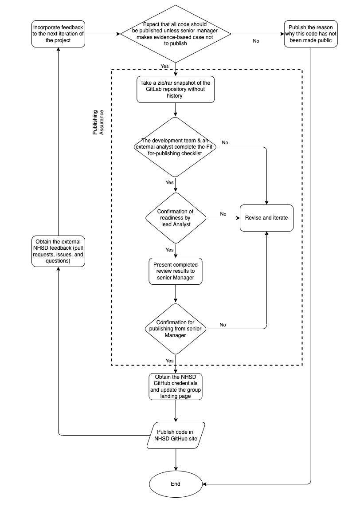

# How to Publish your Code in the Open

In NHS Digital we have committed to publishing more and more of our code over time to **improve the transparency** of our analytical work.

## Why publish your code?

The Government's [Digital Service Standard](https://www.gov.uk/service-manual/service-standard) 12th principle states that all publicly funded code should be open, reusable and available under appropriate licences. The main benefits of publishing your code are:

- It increases transparency on NHS work. This can include publication/dashboard methodologies, but also code ownership.
- It increases collaboration and knowledge sharing across cross-department teams, external users and developers. No time is wasted on requesting permissions or access to code repositories.
- Easier to share and align on standards across the health sector.
- Knowing that your code will be published will lead to your overall code health increasing as analysts and developers will take greater care in ensuring best coding practices and standards are applied.
- Reduce burden by sharing and reusing code. Internal and external users can learn from your code repositories and templates, and apply it to their work or personal projects.

The Government Digital Service released an **[informative video](https://www.youtube.com/watch?v=aqFFCvjXr1s)** on the benefits of coding in the open, from the start of a project.

## How to prepare your code and repository

We have designed a process which will ensure **no sensitive data or algorithms** will be published, removing any risks associated with any type of sensitive information being released.

Projects and publications with the aim to be published should follow the **Fit-for-publishing workflow**:

### Workflow initial steps

1. **Starting point:** After designing and developing the source code on NHS Digital's internal Gitlab platform, you should ensure at this step that your repository, code and tests are all set and ready for external review, having addressed any security concerns. Your project is ready to go through Senior Manager approval for publishing and enter the **Publishing Assurance** phase, once approval is granted. Expect that all code should be published unless there's an evidence based case to not publish (e.g. sensitive algorithm).

2. At the beginning of this phase a **snapshot** of the project's repository is taken (download the zip file of the branch) or a separate GitLab branch is created for the review. The purpose of the snapshot is to remove all repository history and previous commits.

3. After creating the snapshot, the next step is to apply the **Fit-for-publishing checklist**:

### Fit for publishing checklist

This checklist covers the review process in place to ensure that the code is:

1. Fit for purpose
2. Well documented
3. No credentials or personally identifiable information left in the repository
4. No data should be stored in the snapshot.

To access the checklist click on the link below and select the Download option:

- PDF version for viewing: [Fit for publishing checklist PDF](../images/Fit_for_publishing_checklist.pdf)
- Download the Work doc version to edit: [Fit for publishing checklist Word](../images/Fit_for_publishing_checklist.docx)

For each subsection of the checklist:

- an **internal reviewer** (someone who worked on the project) is assigned by the development team to check and add comments and suggestions to be implemented. Once those are reviewed and implemented the checklist is passed on to
- an **external reviewer** (outside of the development team) to carry out checks and add any comments and suggestions in the external review columns.
- Once the external review is complete, each checklist section is assigned a **RAG status** by the project's lead analyst (**Confirmation of Readiness by Lead Analyst step in the workflow diagram above**).
- Once the repository is granted the **final confirmation** for publishing from a Senior Manager (as per the workflow diagram shown above), you can then proceed to the final step, which is going **live** with your Github repository on the [NHS Digital public repository](https://github.com/NHSDigital).

**Please note:** Should the workflow at any point reach to a failed step, follow the workflow diagram towards the revision and iteration steps.

### Moving your code to the NHS Digital GitHub

To publish the code on Github, you need to make a repo and then just upload your repo snapshot (see above). You'll need to be, or become a member of the [NHS Digital Github organisation](https://github.com/NHSDigital) to do this.

> For NHS Digital colleagues, [we've made a guide with specifically how you do each of the above](https://nhsd-confluence.digital.nhs.uk/display/KH/Github+-+publishing+your+code).

### Adding topics to your GitHub repository
Adding topics to your repository can be useful for users who are searching on GitHub to find similar topics of interest, e.g. an user searching for RAP repositories using `rap` or a user searching for NHS repositories containing analytical work with the topic `nhs-digital-publication`. GitHub has very good documentation on how to add topics to your repository, see [here](https://docs.github.com/en/repositories/managing-your-repositorys-settings-and-features/customizing-your-repository/classifying-your-repository-with-topics).

### Updating the Data Services - Analytics Service repository
Once a new publication's repository is published on GitHub, feel free to update the [Data Services - Analytics Service repository](https://github.com/NHSDigital/data-analytics-services) to reflect this change.

## Further reading

- [Sharing Code in the Open by NHSX](https://nhsx.github.io/AnalyticsUnit/codeintheopen.html)
- [Be open and use open source](https://www.gov.uk/guidance/be-open-and-use-open-source)
- [The benefits of coding in the open](https://gds.blog.gov.uk/2017/09/04/the-benefits-of-coding-in-the-open/)
- [Open source repositories by the Government Digital Service](https://github.com/alphagov)
